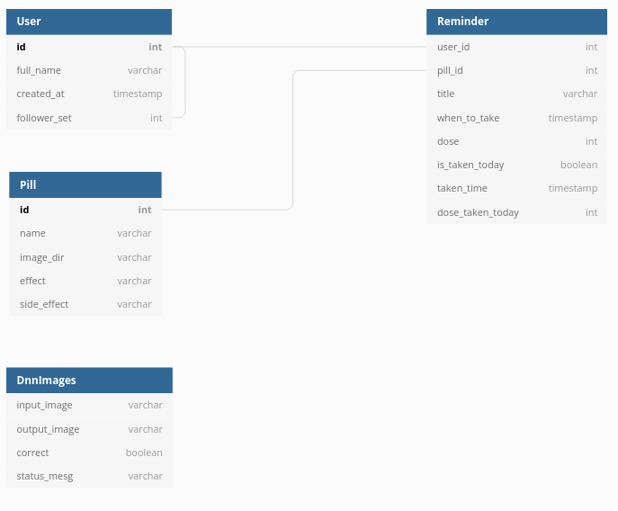

# Backend Server for PharmaSEE ([🔗Blog Post](https://yundayoung1028.wixsite.com/website/post/pharmasee-backend-server-development))
This is the server for the [PahrmaSEE project](https://github.com/Pharma-SEE) implemented in Python Django. We utilized the django rest framework to develop a RESTful API for React Native Clients requesting CRUD operations on user accounts and personal medication data. It receives images from clients and performs object dection, sending back result images marked with X and O on each pill. Also acts as a proxy server for Nugu AI speakers by creating response messages that contains the user's medicine intake information.

Check [here](https://yundayoung1028.wixsite.com/website/post/pharmasee-backend-server-development) for details.

### Database Schema

### Content
- [Sign Up / Login Implementation](backend/accounts)
- [REST API for CRUD Operations](backend/pharmasee)
- [Proxy Server for Nugu AI Speaker](backend/nugu/views.py)
- [Object Detection and Image Transfer](backend/pill_ai)
- [Settings for AWS Lightsail Deployment](backend/settings)
